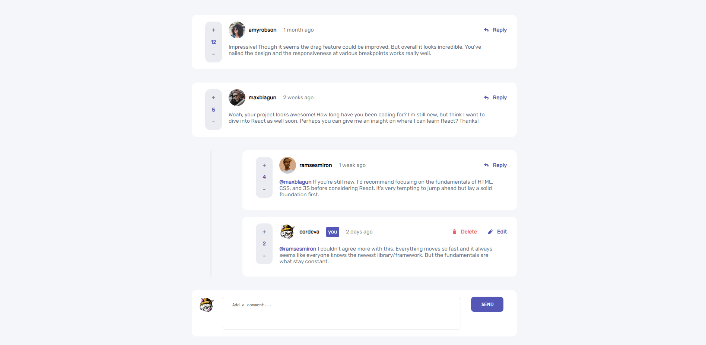
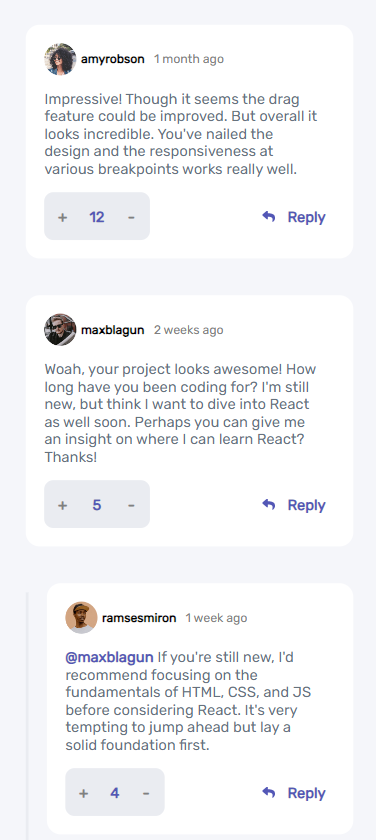

# Frontend Mentor - Interactive comments section solution

This is a solution to the [Interactive comments section challenge on Frontend Mentor](https://www.frontendmentor.io/challenges/interactive-comments-section-iG1RugEG9).

## Table of contents

- [Overview](#overview)
  - [The challenge](#the-challenge)
  - [Screenshot](#screenshot)
  - [Links](#links)
- [My process](#my-process)
  - [Built with](#built-with)
  - [What I learned](#what-i-learned)

## Overview

### The challenge

The project have the following features

- Voting System:
Users can upvote and downvote comments.
If a user attempts to vote on their own comment, a message is displayed.
Votes are updated instantly and reflected in the comment's score.

- Comment Interaction Options:
Users can reply to a comment.
Users can edit their own comments.
Users can delete their own comments.
Delete confirmation is provided with a popup.

- Reply Section:

Comments can have replies, which are displayed below the comment.
Users can add replies to comments.

- Responsive Design:

### Screenshot

#### Desktop Version

#### Mobile Version

### Links

- Live Site URL: [Click Here](https://xcordeva.github.io/interactive-comments-section-FrontendmentorChallenges)

## My process

### Built with

- Semantic HTML5 markup
- CSS custom properties
- Flexbox
- Javascript
- [React](https://reactjs.org/) - JS library

### What I learned

In working on these components and this React project, I've learned the following:

- React Fundamentals:

This was my first React project and I've gained a strong understanding of React, including components, state management, and props.

- Conditional Rendering:

I've learned how to conditionally render UI elements based on user interactions or specific conditions.

- API Interaction:

I've learned how to interact with a backend API to perform operations like adding, editing, and deleting comments.

- Firebase and Firestore:
This project was my first experience with Firebase and Firestore. I gained a lot of experience in setting up a live database, performing data operations such as adding, editing, and deleting comments, and integrating real-time updates into my web application.

